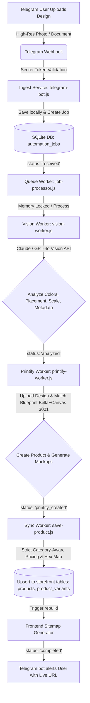

# Drip Street Backend Automation Pipeline - Implementation Report

This report documents the design, architecture, and deployment procedures for the end-to-end backend automation pipeline implemented for **Drip Street**. The pipeline connects a Telegram bot to Vision AI analysis, Printify print-on-demand product creation, and local SQLite storefront synchronization.

---

## 🚀 Pipeline Overview & Flow Chart



---

## 🏗️ Architecture & Component Design

### 1. Ingest Layer (`backend/services/ingest/telegram-bot.js`)
*   **Webhook Interface:** Exposes a secure POST handler `/api/automation/telegram-webhook` to ingest incoming Telegram messages.
*   **Webhook Secret Validation:** Validates the standard `x-telegram-bot-api-secret-token` header against the local environment (`TELEGRAM_WEBHOOK_SECRET`) to secure the endpoint from third-party calls.
*   **Media Downloader:** Dynamically handles both compressed standard photos and uncompressed high-resolution PNG document uploads, automatically choosing the highest resolution photo, downloading it streams-based to the local disk (`backend/data/uploads`), and inserting a tracking record in `automation_jobs` with status `'received'`.

### 2. Queue & Lock Mechanism (`backend/services/queue/job-processor.js`)
*   **Lightweight SQLite Polling Queue:** To avoid adding heavy Redis dependencies (like BullMQ) to the SQLite environment, a robust polling worker triggers every **10 seconds**.
*   **In-Memory Job Locks:** Utilizes an in-memory `Set` containing active processing job IDs to completely prevent concurrent duplicate thread execution for the same job during heavy asynchronous API operations.
*   **Sequential Transition Chaining:** Processes jobs sequentially through `'received'` ➔ `'analyzed'` ➔ `'printify_created'` ➔ `'completed'`, and handles transient status markings (`'processing_vision'`, `'processing_printify'`, `'processing_sync'`) with recovery locks in SQLite to handle unexpected process restarts.

### 3. Vision AI Worker (`backend/services/vision/vision-worker.js`)
*   **Dual Vision Engine:** Seamlessly supports both OpenAI (`gpt-4o`) and Anthropic Claude (`claude-3-5-sonnet-20240620`) structured JSON-mode requests.
*   **Intelligent Prompting:** Instructs the Vision model to analyze the transparent graphic against light and dark shirts, extract **3 primary coordinating apparel colors** (e.g. Black, White, Natural), optimize print placement coordinates (`front`/`back`), set perfect scaling constraints (`0.1` to `1.0`), and write minimalist, high-converting streetwear titles/descriptions.
*   **Mock Fallback Mode:** Implements a highly functional local developer mockup fallback when API keys are unconfigured, ensuring 100% testability offline.

### 4. Printify Creator (`backend/services/printify/printify-worker.js`)
*   **Uploads API:** Converts the locally stored high-res design to a base64 string and uploads it to the Printify repository.
*   **Blueprint & Provider Alignment:** Leverages Blueprint ID `382` (Bella+Canvas 3001) and Print Provider `29` (Monster Digital).
*   **Size and Color Filter Mapping:** Resolves all available variants for the product, filters sizes `S-3XL` that exactly match the 3 Vision-selected coordinating colors, compiles the layout blueprint, creates the live print-on-demand product inside the shop, and extracts the generated preview Mockup URLs.

### 5. Pricing Engine & DB Sync (`backend/services/sync/save-product.js`)
*   **Strict Category Pricing Rules:** Evaluates the product title/description to check for hood/sweatshirt terms. Enforces strict Drip Street brand prices:
    *   **T-Shirts:** `149.90 ILS` (approx. `39.97 USD`)
    *   **Hoodies:** `229.90 ILS` (approx. `61.31 USD`)
*   **Color-to-Hex Coordinator:** Employs an exact color-to-hex coordinate lookup table (e.g. `natural` ➔ `#eed9c4`, `sand` ➔ `#e5d3b3`, `black` ➔ `#000000`) to feed standard storefront filter UI requirements.
*   **Database Upsert:** Safely upserts records to the storefront `products` and `product_variants` tables, handling all 18 size/color permutations.
*   **Sitemap Rebuilder:** Programmatically executes the ES module sitemap rebuilder `frontend/scripts/generate-sitemap.js` upon completion, automatically index-refreshing all newly added product pages.

---

## 🛠️ Files Created & Modified in `./backend`

| Action | Path | Description |
| :--- | :--- | :--- |
| **[NEW]** | [telegram-bot.js](file:///C:/Users/yohan/.gemini/antigravity/scratch/custom-ecommerce/backend/services/ingest/telegram-bot.js) | Telegram Bot Webhook endpoint, schema initialization, high-res file ingest downloader. |
| **[NEW]** | [job-processor.js](file:///C:/Users/yohan/.gemini/antigravity/scratch/custom-ecommerce/backend/services/queue/job-processor.js) | DB polling queue system, concurrency locks, and job lifecycle manager. |
| **[NEW]** | [vision-worker.js](file:///C:/Users/yohan/.gemini/antigravity/scratch/custom-ecommerce/backend/services/vision/vision-worker.js) | Base64 image compiler, OpenAI/Anthropic Vision model API integrations, mockup simulator. |
| **[NEW]** | [printify-worker.js](file:///C:/Users/yohan/.gemini/antigravity/scratch/custom-ecommerce/backend/services/printify/printify-worker.js) | Printify image uploader, variant filter matching, blueprint assembler, mockup extractor. |
| **[NEW]** | [save-product.js](file:///C:/Users/yohan/.gemini/antigravity/scratch/custom-ecommerce/backend/services/sync/save-product.js) | STRICT category pricing rules, hex-color mappings, local SQLite storefront sync, sitemap generator trigger. |
| **[MODIFY]** | [index.js](file:///C:/Users/yohan/.gemini/antigravity/scratch/custom-ecommerce/backend/index.js) | Mounted new `/api/automation/telegram-webhook` router and started the queue processor on server boot. |

---

## 🖥️ Local Webhook Testing & Tunneling Guide

Because Telegram webhooks require an absolute, public-facing HTTPS endpoint, you must tunnel your local development environment.

### Step 1: Start the local tunnel
Using a tunneling utility like `ngrok`, bind your local port `4000`:
```bash
ngrok http 4000
```
*Take note of the public HTTPS URL forwarded by ngrok (e.g. `https://abcd-12-34.ngrok-free.app`).*

### Step 2: Set the Telegram Webhook
Trigger the official Telegram API command to register your webhook with a custom secret token for maximum security:
```bash
curl -X POST "https://api.telegram.org/bot<YOUR_TELEGRAM_BOT_TOKEN>/setWebhook" \
     -H "Content-Type: application/json" \
     -d '{
       "url": "https://abcd-12-34.ngrok-free.app/api/automation/telegram-webhook",
       "secret_token": "YOUR_TELEGRAM_WEBHOOK_SECRET"
     }'
```

### Step 3: Configure `.env`
Update your `./backend/.env` with the corresponding secrets:
```env
TELEGRAM_BOT_TOKEN=8704445231:AAGbAd66s1eSAg5MruyYxPQzJFyNkDk0EjY
TELEGRAM_WEBHOOK_SECRET=YOUR_TELEGRAM_WEBHOOK_SECRET
PRINTIFY_API_KEY=YOUR_PRINTIFY_API_KEY
OPENAI_API_KEY=YOUR_OPENAI_API_KEY
```

---

## 🚀 Deploying to Render (Production Environment)

To deploy the new pipeline securely to Render:

### Step 1: Environment Variables Configuration
Navigate to your **Render Dashboard** ➔ **Web Service Settings** ➔ **Environment** and add the production keys:

| Key | Description | Example / Recommendations |
| :--- | :--- | :--- |
| `TELEGRAM_BOT_TOKEN` | Your live Telegram Bot token from BotFather | `8704445231:AAGb...` |
| `TELEGRAM_WEBHOOK_SECRET` | A complex high-entropy secret string to validate requests | `drip_webhook_sec_8xL9p2...` |
| `PRINTIFY_API_KEY` | Printify personal access token from Printify Settings | `prtf_...` |
| `OPENAI_API_KEY` | OpenAI secret API key (with gpt-4o access) | `sk-proj-...` |
| `ANTHROPIC_API_KEY` | Anthropic secret API key (Claude 3.5 fallback, optional) | `sk-ant-...` |

### Step 2: Set the Production Webhook
Execute the curl command using your live Render external URL:
```bash
curl -X POST "https://api.telegram.org/bot<TELEGRAM_BOT_TOKEN>/setWebhook" \
     -H "Content-Type: application/json" \
     -d '{
       "url": "https://dripstreet-backend.onrender.com/api/automation/telegram-webhook",
       "secret_token": "<TELEGRAM_WEBHOOK_SECRET>"
     }'
```

### Step 3: Trigger a Manual Deploy
Render will automatically detect the modifications to `backend/index.js` and build configurations.
1.  **Build Command:** `npm install` (inside the backend workspace root).
2.  **Start Command:** `node index.js` (automatically runs the server and boots the DB polling queue worker simultaneously).

*The pipeline will immediately begin listening and executing designs securely!*
